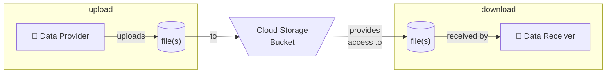

# Google Cloud - Cloud Storage Bucket - Cookiecutter Template



This project is a [Cookiecutter](https://github.com/cookiecutter/cookiecutter) template for creating a [Cloud Storage](https://cloud.google.com/storage/) bucket on [Google Cloud](https://cloud.google.com/) with a service account and related key to enable data or file upload and use.

The template uses [Terraform](https://developer.hashicorp.com/terraform/intro) to maintain cloud resources. See Terraform readme's under the `terraform` directory for documentation on Terraform elements.

## ✍️ Using the template

Install the latest version of Cookiecutter:

```shell
pip install cookiecutter
```

Generate a Python package project from the template in this repository:

```shell
python -m cookiecutter https://github.com/CU-DBMI/gc-cloud-storage-bucket.git
```

## 🧑‍💻 Development

Development for this repository is assisted by the following technologies:

- [Poetry](https://python-poetry.org/docs/): Used to help configure pre-commit for local development work.
- [Pre-commit](https://pre-commit.com): Used for performing checks within local development environment and via Github Actions automated testing. The following sub-items are used as checks through [pre-commit-terraform](https://github.com/antonbabenko/pre-commit-terraform) and require local installation when testing outside of Dagger:
  - [terraform_docs](https://github.com/terraform-docs/terraform-docs/): Used to automatically generate Terraform-specific documentation.
  - [tflint](https://github.com/terraform-linters/tflint): Used to perform static analysis (linting) on Terraform content.
  - [tfsec](https://github.com/aquasecurity/tfsec): Used to perform security-focused static analysis (security linting) on Terraform content.
- [Dagger](https://docs.dagger.io/): Used to help orchestrate reproducible testing within local development environment and for automated testing.
