# Google Cloud - Cloud Storage Bucket - Cookiecutter Template

```mermaid
flowchart LR
    subgraph upload
      files[("file(s)")]
      data-provider["👤 Data Provider"]

    end
    subgraph download
      data-receiver["👤 Data Receiver"]
      files2[("file(s)")]
    end
    bucket[\"Cloud Storage\n Bucket"/]
    files --> |to| bucket
    data-provider --> |uploads| files
    bucket --> |provides\naccess to| files2
    files2 --> |received by| data-receiver

```



This project is a [Cookiecutter](https://github.com/cookiecutter/cookiecutter) template for creating a [Cloud Storage](https://cloud.google.com/storage/) bucket on [Google Cloud](https://cloud.google.com/) with a service account and related key to enable data or file upload and use.

The template uses [Terraform](https://developer.hashicorp.com/terraform/intro) to maintain cloud resources. See Terraform readme's under the `terraform` directory for documentation on Terraform elements.

## Using the template

Install the latest version of Cookiecutter:

```shell
# for example
pip install cookiecutter
```

Generate a Python package project from the template in this repository:

```shell
python -m cookiecutter https://github.com/CU-DBMI/gc-cloud-storage-bucket.git
```
